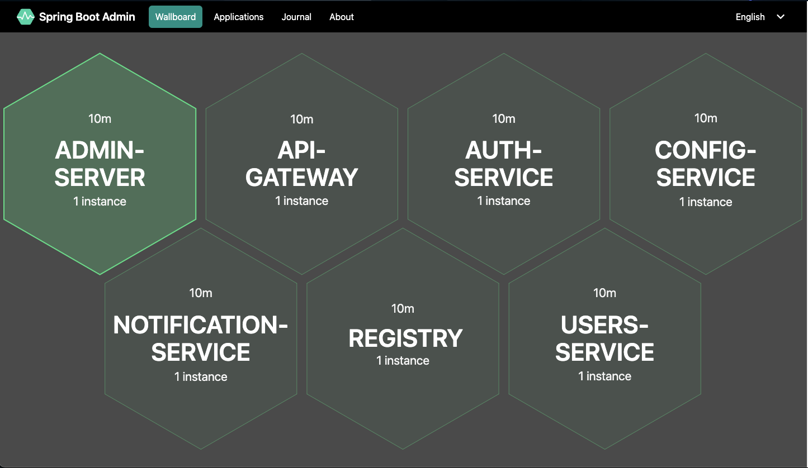

# Microservices Registry



This project provides a registry for managing microservices. It is built using Java Spring Boot 3 and includes configurations for Docker and Jenkins.

## Features

- **Service Registration and Discovery:** Microservices can register themselves and discover other services.
- **Health Checks:** Integrated health checks to ensure the services are up and running.
- **Configuration Management:** Centralized configuration management for microservices.

## Technologies Used

- Java
- Spring Boot
- Docker
- Jenkins

## Getting Started

### Prerequisites

- **Java 17**
- **Docker**
- **Maven>=3.8**
- **PORT :** 8761

### Installation

1. Clone the repository:
    ```bash
    git clone https://github.com/bhupendrasambare/microservices-registry.git
    cd microservices-registry
    ```

2. Build the project using Maven:
    ```bash
    ./mvnw clean install
    ```

3. Run the application:
    ```bash
    java -jar target/microservices-registry-0.0.1-SNAPSHOT.jar
    ```

### Running with Docker

1. Build the Docker image:
    ```bash
    docker build -t microservices-registry .
    ```

2. Run the Docker container:
    ```bash
    docker run -d -p 8761:8761 microservices-registry
    ```

### Jenkins Integration

The project includes a `Jenkinsfile` for CI/CD integration. Ensure Jenkins is set up with Docker and Maven installed.


## Contributing

1. Fork the repository.
2. Create a new branch (`git checkout -b feature-branch`).
3. Make your changes.
4. Commit your changes (`git commit -am 'Add new feature'`).
5. Push to the branch (`git push origin feature-branch`).
6. Create a new Pull Request.

## License

This project is licensed under the MIT License. See the [LICENSE](LICENSE) file for details.

## Contact

For any questions or suggestions, please contact [Bhupendra Sambare](https://github.com/bhupendrasambare).

---

*This project is part of Bhupendra Sambare's repositories on GitHub.*
